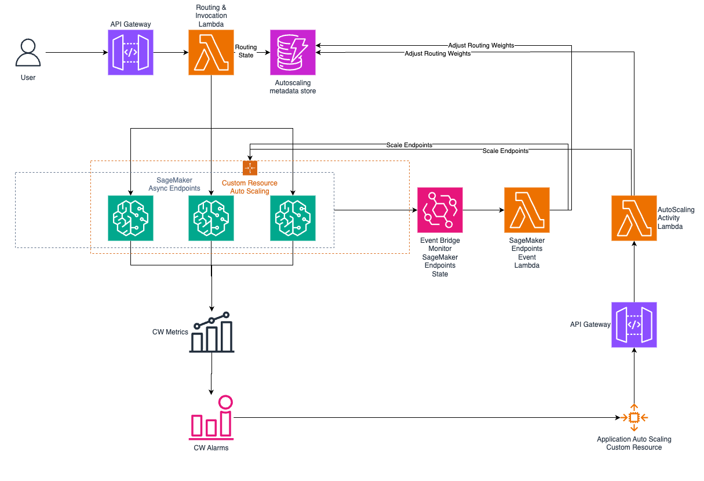

# Autoscaling SageMaker endpoints with custom resource
## Overview
This sample is intended to show how Application Auto Scaling can be used to scale a fleet of Amazon SageMaker AI endpoint as single unit. If you are looking to scale a single SageMaker endpoint, please refer to [SageMaker AI Documentation](https://docs.aws.amazon.com/sagemaker/latest/dg/endpoint-auto-scaling.html) instead.

## Solution Architecture

The above solution include 5 main components:
* Routing component: API Gateway + Lambda + DynamoDB to have a stateful routing logic.
* SageMaker AI endpoints: These are the endpoints you want to auto scale.
* Application Auto Scaling component: This includes the scaling metric + Alarm + Application Auto Scaling Custom Resouce. This component will monitor the scaling alarms an generate scaling activies based on these alarms.
* Scaling Activity component: API Gateway + Lambda + DynamoDB that respond to the scaling activies by updating the endpoints and adjusting weights in DynamoDB.
* Endpoints State Change component: Event bridge rule + lambda + DynamoDB to monitor SageMaker AI endpoint state change and respond to that change if required by updating endpoints and adjusting routing weights.
## Routing Logic
When the *Routing API Gateway* recieves invocations, it will trigger the *Routing and Invocation Lambda* which routes the requests to SageMaker AI endpoints based on weights stored in the Autoscaling metadata store (which is a DynamoDB table). The routing logic is based on weighted round-robin algorithm. Since Amazon Lambda functions are stateless, a counter of number of invocations is recorded in the DynamoDB table to keep track of the current state.

The routing logic can be found in [router-lambda.py](router-lambda.py). You can customize this logic to modify or implement different routing logic.

## Scaling logic
For Auto Scaling with Target tracking, we define a sclaing metric as the maximum value of the average **ApproximateBacklogSizePerInstance** metric for all SageMaker AI endpoints. When a scaling out activity is initiated, the *AutoScaling Activity Lambda* scales all SageMaker AI endpoints out. Once the endpoints status changes from *Updating* to *InService*, the *SageMaker Endpoints Event Lambda* would then scale in SageMaker AI endpoints to make sure the Actual instance count matches the Desired instance count.

The scaling logic can be found in [asg-activity-lambda.py](asg-activity-lambda.py) and [endpoint-state-lambda.py](endpoint-state-lambda.py). You can customize this logic to modify or implement different scaling logic.
## How to deploy this solution:
Use the below CloudFormation templates to deply a working sample
1. [Deploy SageMaker AI Endpoints](SageMaker-Async-Endpoints.yaml) (Optional): This template will deploy 3 test Async endpoints in your account. You will need to first build docker image and push it to Amazon Elastic Container Registry (ECR). You can do this by pulling this git repo and running [build_and_push.sh](SageMaker_container/build_and_push.sh). Use the image ECR uri when deploying this CloudFormation template. 
 ***IMPORTANT:*** If you are using your own SageMaker endpoint, make sure to name the endpoints in the following convention: 
`<endpoint-name>-<endpoint-name-extension 1>, <endpoint-name>-<endpoint-name-extension 2>, <endpoint-name>-<endpoint-name-extension 2>`. Example: `endpoint-1, endpoint-2, endpoint-3`.
2. [Deploy the solution](CFN-template.yaml) (CFN-template.yaml): Before deploying this template, please ensure to do the below steps. 
    a. Download the zipped code from the latest [release](sample-for-autoscaling-sagemaker-endpoints-with-custom-resource). 
    b. Upload the zipped code to Amazon S3 and rename the file to `code.zip`. 
    c. Modify the [Autoscaling metadata store data](Data/ddb-data.jsonl) to update `server_config` record with your current endpoint name extensions. For example, if your endpoints are `endpoint-1, endpoint-2, endpoint-3`, use `1, 2, 3` as value for `servers`. Also make sure to update `current_instance_count` to reflect the actual currrent instance count. Finally, update `custom-resource:ResourceType:Property` record to reflect `actualCapacity`, `resourceName` (use `endpoint` if your endpoints name starts with `endpoint`) and `variantName`. You do not have to change anything if you are using [Deploy SageMaker AI Endpoints](SageMaker-Async-Endpoints.yaml) CloudFormation template with its default values.

## Testing the solution
Upload [payload.csv](SageMaker_container/payload.csv) to S3 before you can test this solution
Use [invoke-router-api.py](invoke-router-api.py) to send invocations to the router API one time each run.
## Clean up
Deploying this solution can incur cost, make sure to delete all deployed CloudFormation stacks when you are done with them.

## Security

See [CONTRIBUTING](CONTRIBUTING.md#security-issue-notifications) for more information.

## License

This library is licensed under the MIT-0 License. See the LICENSE file.

